# Introduction to Machine Learning

- [Introduction to Machine Learning](#introduction-to-machine-learning)
  - [What is Machine Learning?](#what-is-machine-learning)
  - [How Traditional Programming is different from Machine Learning?](#how-traditional-programming-is-different-from-machine-learning)
  - [Applications of Machine Learning](#applications-of-machine-learning)
  - [The historical context of machine learning](#the-historical-context-of-machine-learning)
  - [The Data Science Process](#the-data-science-process)
    - [The OSEMN Framework](#the-osemn-framework)
  - [Common Types of Data](#common-types-of-data)
  - [Tabular Data](#tabular-data)
    - [Vectors](#vectors)
  - [Scaling Data](#scaling-data)
    - [Standardization](#standardization)
    - [Normalization](#normalization)
  - [Encoding Categorical Data](#encoding-categorical-data)
    - [Ordinal Encoding](#ordinal-encoding)
    - [One-Hot Encoding](#one-hot-encoding)
  - [Image Data](#image-data)
    - [Encoding an Image](#encoding-an-image)
  - [Text Data](#text-data)
    - [Text Normalization](#text-normalization)
      - [Lemmatization](#lemmatization)
      - [StopWords](#stopwords)
    - [Vectorization](#vectorization)
    - [Feature Extraction](#feature-extraction)
    - [ML Pipeline for Text Classification](#ml-pipeline-for-text-classification)
  - [Two Perspectives on ML: Computer science vs. Statistical perspective](#two-perspectives-on-ml-computer-science-vs-statistical-perspective)
  - [Machine Learning EcoSystem](#machine-learning-ecosystem)
  - [Models vs Algorithms](#models-vs-algorithms)
  - [Linear Regression](#linear-regression)
    - [Simple Linear Regression](#simple-linear-regression)
    - [Linear Regression in Machine Learning](#linear-regression-in-machine-learning)
    - [Multiple Linear Regression](#multiple-linear-regression)
    - [Training a Linear Regression Model](#training-a-linear-regression-model)
      - [The Cost Function](#the-cost-function)
      - [Preparing the Data](#preparing-the-data)
      - [Calculating the Coefficients](#calculating-the-coefficients)

***

## What is Machine Learning?

Definition 1: **Machine learning is the science of getting computers to act without being explicitly programmed. - Andrew Ng**

Definition 2: Machine learning is a data science technique used to extract patterns from data, allowing computers to identify related data, and forecast future outcomes, behaviors, and trends.

Definition 3: A subcategory of artificial intelligence that involves learning from data without being explicitly programmed.

***

## How Traditional Programming is different from Machine Learning?

In traditional programming we use data and rules as input to process and get the output/result while in Machine Learning we pass on the data and the output/result to the machine to figure out the rules by itself (train the model) that can be used later on to feed input and get the desired output.

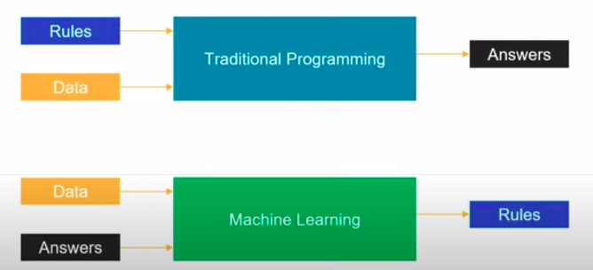

***

## Applications of Machine Learning

The applications of machine learning are extremely broad! And the opportunities cut across industry verticals. Whether the industry is healthcare, finance, manufacturing, retail, government, or education, there is enormous potential to apply machine learning to solve problems in more efficient and impactful ways.

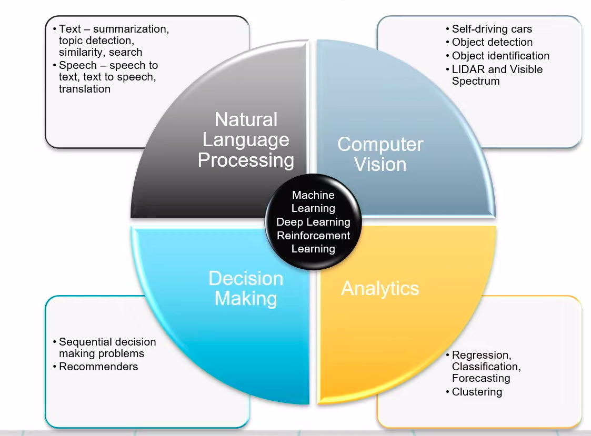

Few examples of applied Machine Learning:

- **Automate the recognition of disease**: Trained physicians can only review and evaluate a limited volume of patients or patient images (X-rays, sonograms, etc.). Machine learning can be used to spot the disease, hence reducing physician burnout. For example, [Google has trained a deep learning model to detect breast cancer](https://www.mercurynews.com/2017/03/03/google-computers-trained-to-detect-cancer/) and [Stanford researchers have used deep learning models to diagnose skin cancer](https://news.stanford.edu/2017/01/25/artificial-intelligence-used-identify-skin-cancer/).

- **Recommend next best actions for individual care plans**: With the mass digitization of patient data via systems that use [EMRs (Electronic Medical Records) and EHRs (Electronic Health Records)](https://en.wikipedia.org/wiki/Electronic_health_record), machine learning can be used to help build effective individual care plans. For example, [IBM Watson Oncology](https://www.ibm.com/products/clinical-decision-support-oncology) can help clinicians explore potential treatment options. More examples of how machine learning impacts healthcare can be found [here](https://www.forbes.com/sites/nicolemartin1/2019/08/30/how-healthcare-is-using-big-data-and-ai-to-cure-disease/#64671f7e45cf).

- **Enable personalized, real-time banking experiences with chatbots**: You've likely encountered this when you call a customer service number. Machine learning can be used to intercept and handle common, straightforward issues through chat and messaging services, so customers can quickly and independently resolve simple issues that would otherwise have required human intervention. With the chatbot, a customer can simply type in a question and the bot engages to surface the answer. Refer to [this article](https://www.drift.com/learn/chatbot/ai-chatbots/) to find more information about chatbot powered machine learning.

- **Identify the next best action for the customer**: Real-time insights that incorporate machine learning tools—such as [sentiment analysis](https://www.concur.com/newsroom/article/machine-learning-with-heart-how-sentiment-analysis-can-help-your)—can help organizations assess the likelihood of a deal closing or the level of a customer’s loyalty. [Personally-tailored recommendations](https://medium.com/@madasamy/introduction-to-recommendation-systems-and-how-to-design-recommendation-system-that-resembling-the-9ac167e30e95) powered by machine learning can engage and delight customers with information and offers that are relevant to them.

- **Capture, prioritize, and route service requests to the correct employee, and improve response times**:
A busy government organization gets innumerable service requests on an annual basis. Machine learning tools can help to capture incoming service requests, to route them to the correct employee in real-time, to refine prioritization, and improve response times. Can check out [this article](https://monkeylearn.com/blog/ticket-routing/) if you're curious to learn more about ticket routing

***

## The historical context of machine learning

- *Artificial Intelligence* : A broad term that refers to computers thinking more like humans.
- *Machine Learning* : A subcategory of artificial intelligence that involves learning from data without being explicitly programmed.
- *Deep Learning* : A subcategory of machine learning that uses a layered neural-network architecture originally inspired by the human brain.

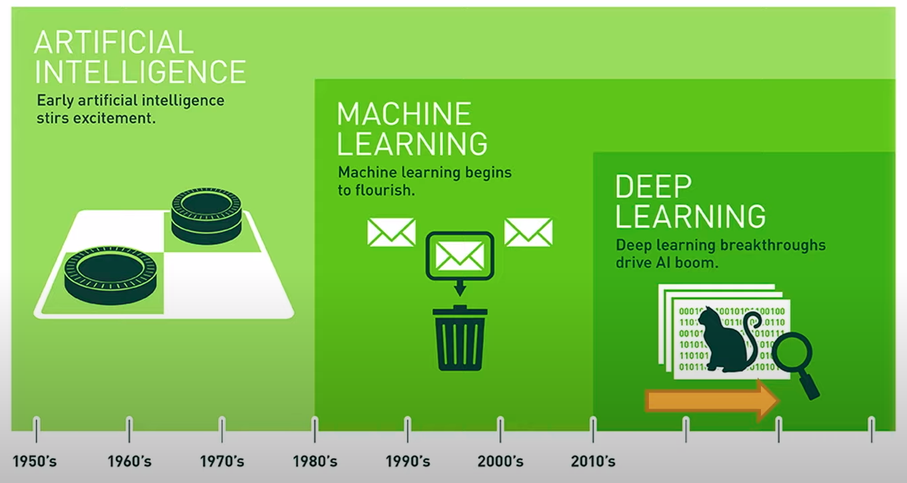

Further Reading: [What’s the Difference Between Artificial Intelligence, Machine Learning and Deep Learning? by Michael Copeland at NVIDIA](https://blogs.nvidia.com/blog/2016/07/29/whats-difference-artificial-intelligence-machine-learning-deep-learning-ai/)

***

## The Data Science Process

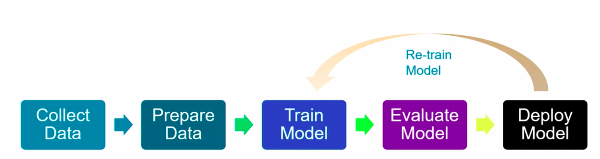

1. *Data Collection* : This involves collection the data from various sources and handling the amount of data.
2. *Data Preparation* : In this step, the relevant features affecting the end result are marked and kept for further research and the rest are either standardized or removed, based on the requirement. Data wrangling is a part of this process.
3. *Model Training* : This step usually involves selecting an algorithm based on data and usecase. Then dividing the data into Training , Testing, and Validation(Optional) sets for further process.
4. *Model Evaluation* : At this stage, we run the model on the validation set of the input data to assert its accuracy, precision and so on.
5. *Model Deployment* : This is usually the last step - the best model is used based on different parameters such as accuracy, precision and recall and is deployed on some web service, API etc.
6. *Re-training* : When we get new data, we might need to re-train the model to get the model adjusted with the new data or in between training and deployment, we re-train the model several times to get the best parameters for the final model.

### The OSEMN Framework

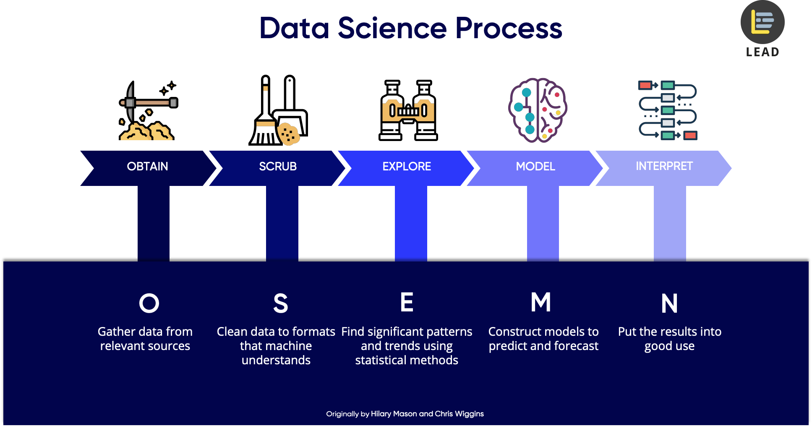

Further Reading: [5 Steps of a data science project](https://towardsdatascience.com/5-steps-of-a-data-science-project-lifecycle-26c50372b492)

***

## Common Types of Data

In Data Science, we deal with different types of data. Here are the few types of data that we deal with:

- *Numerical* - **It's All Numerical in the End**. This involves integer or float data.

- *Time-Series* - Evenly spaced data in different points of time or simply data that contains datetime values in it. It is a series of numerical data which can be arranged in an order.e.g - Population data over the years, stock market data.

- *Categorical* - This type of data if of mainly some specific categories in which the entire dataset is divided into - generally has low cardinality but this type of data requires a very high efficiency while handling it.e.g gender.

- *Text* - This type of data comprises words, sentences, articles etc and it is a challenge to get these converted into a machine understandable form. We use NLP to handle text data.

- *Image* - Image frames from video stream or simply the entire video stream - again the same problem of converting these into numerical form to make some sense out of it.

**All data in machine learning eventually ends up being numerical, regardless of whether it is numerical in its original form, so it can be processed by machine learning algorithms.**

***

## Tabular Data

In machine learning, the most common type os data is tabular data i.e the data arranged in the form of rows and columns that is essentially the same format as you work with when you look at data in a spreadsheet.

| SKU Make | Color | Quantity | Price |
| -------- | ----- | -------- | ----- |
| 908721 | Guess Blue | 789 | 45.33 |
| 456552 | Tillys Red | 244| 22.91 |
| 789921 | A&F Green | 387 | 25.92 |
| 872266 | Guess Blue | 154 | 17.56 |

### Vectors

It is important to know that in machine learning we ultimately always work with numbers or specifically vectors.
> A vector is simply an array of numbers, such as (1, 2, 3)—or a nested array that contains other arrays of numbers, such as (1, 2, (1, 2, 3)).

For now, the main points you need to be aware of are that:

- All non-numerical data types (such as images, text, and categories) must eventually be represented as numbers
- In machine learning, the numerical representation will be in the form of an array of numbers—that is, a vector

***

## Scaling Data

> Scaling data means transforming it so that the values fit within some range or scale, such as 0–100 or 0–1.

There are a number of reasons why it is a good idea to scale your data before feeding it into a machine learning algorithm.

Let's consider an example. Imagine you have an image represented as a set of RGB values ranging from 0 to 255. We can scale the range of the values from 0–255 down to a range of 0–1. This scaling process will not affect the algorithm output since every value is scaled in the same way. But it can speed up the training process, because now the algorithm only needs to handle numbers less than or equal to 1.

Two common approaches to scaling data include standardization and normalization.

### Standardization

Standardization rescales data so that it has a mean of 0 and a standard deviation of 1.

The formula for this is:

`(𝑥 − 𝜇)/𝜎`

We subtract the mean (𝜇) from each value (x) and then divide by the standard deviation (𝜎).

To understand why this works, it helps to look at an example. Suppose that we have a sample that contains three data points with the following values: `50, 100, 150`.
The mean of our data would be `100`, while the sample standard deviation would be `50`. Thus our transformed data points would be `-1, 0, 1`.

Again, the result of the standardization is that our data distribution now has a mean of 0 and a standard deviation of 1.

### Normalization

> Normalization rescales the data into the range [0, 1].

The formula for this is: `(𝑥 − 𝑥𝑚𝑖𝑛)/(𝑥𝑚𝑎𝑥 − 𝑥𝑚𝑖𝑛)`

For each individual value, you subtract the minimum value (𝑥𝑚𝑖𝑛) for that input in the training dataset, and then divide by the range of the values in the training dataset. The range of the values is the difference between the maximum value (𝑥𝑚𝑎𝑥) and the minimum value (𝑥𝑚𝑖𝑛).

Considering again the same values: `50, 100, 150`.

The minimum value (𝑥𝑚𝑖𝑛) is `50`, while the maximum value (𝑥𝑚𝑎𝑥) is `150`. The range of the values is 𝑥𝑚𝑎𝑥−𝑥𝑚𝑖𝑛 = 150 − 50 = `100`.

Thus, our transformed data points are: `0, 0.5, 1`.

***

## Encoding Categorical Data

As you may know by now,machine learning algorithms need to have data in numerical form. Thus, when we have categorical data, we need to encode it in some way so that it is represented numerically.

There are two common approaches for encoding categorical data: `ordinal encoding` and `one hot encoding`.

### Ordinal Encoding

In ordinal encoding, we simply convert the categorical data into integer codes ranging from `0 to (number of categories – 1)`.

Let's look again at our example table of clothing products:

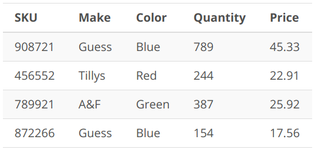

Now, If we apply ordinal encoding to the `Make` and `Color` property, we get the following:

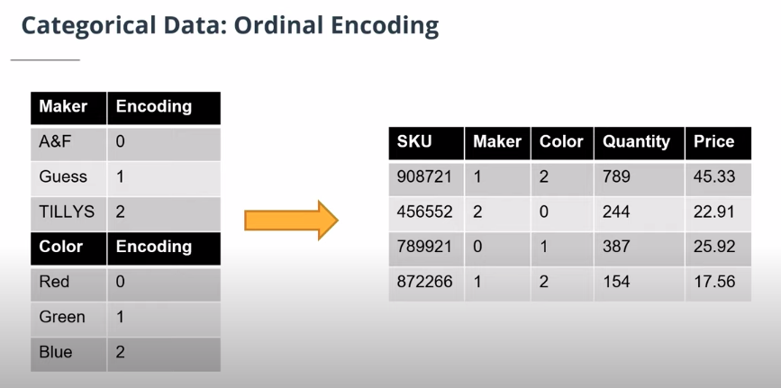

> One of the potential drawbacks to this approach is that it implicitly assumes an order across the categories. In the above example, Blue (which is encoded with a value of 2) seems to be more than Red (which is encoded with a value of 1), even though this is in fact not a meaningful way of comparing those values. This is not necessarily a problem, but it is a reason to be cautious in terms of how the encoded data is used.

### One-Hot Encoding

One-hot encoding is a very different approach.

> In one-hot encoding, we transform each categorical value into a column. If there are `n` categorical values, `n` new columns are added. For example, the `Color` property has three categorical values: `Red, Green, and Blue`, so three new columns `Red, Green, and Blue` are added.

If an item belongs to a category, the column representing that category gets the value `1`, and all other columns get the value `0`. For example, item `908721` (first row in the table) has the color blue, so we put `1` into that `Blue` column for `908721` and `0` into the `Red` and `Green` columns. Item `456552` (second row in the table) has color `red`, so we put `1` into that `Red` column for `456552` and `0` into the `Green` and `Blue` columns.

If we do the same thing for the Make property, our table can be transformed as follows:

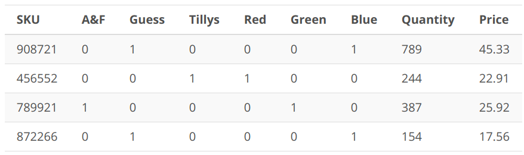

> One drawback of one-hot encoding is that it can potentially generate a very large number of columns.

***

## Image Data

Images are another example of a data type that is commonly used as input in machine learning problems—but that isn't initially in numerical format. So, how do we represent an image as numbers?

Let's look a little closer at how an image can be encoded numerically. If you zoom in on an image far enough, you can see that it consists of small tiles, called `pixels`:


The color of each pixel is represented with a set of values:

- In grayscale images, each pixel can be represented by a single number, which typically ranges from `0 to 255`. This value determines how dark the pixel appears (e.g., 0 is black, while 255 is bright white).
- In colored images, each pixel can be represented by a vector of three numbers (each ranging from 0 to 255) for the three primary color channels: `red, green, and blue`. These three red, green, and blue (RGB) values are used together to decide the color of that pixel. For example, `purple` might be represented as `128, 0, 128` (a mix of moderately intense red and blue, with no green).
- The number of channels required to represent the color is known as the `color depth` or `simply depth`. With an `RGB` image, `depth = 3`, because there are three channels (Red, Green, and Blue). In contrast, a grayscale image has depth = 1, because there is only one channel.

### Encoding an Image

Let's now talk about how we can use this data to encode an image. We need to know the following three things about an image to reproduce it:

- Horizontal position of each pixel
- Vertical position of each pixel
- Color of each pixel

Thus, we can fully encode an image numerically by using a vector with three dimensions. The size of the vector required for any given image would be the `height * width * depth` of that image.

***

## Text Data

Text is another example of a data type that is initially non-numerical and that must be processed before it can be fed into a machine learning algorithm. Let's have a look at some of the common tasks we might do as part of this processing.

### Text Normalization

One of the challenges that can come up in text analysis is that there are often multiple forms that mean the same thing. For example, the verb to be may show up as is, am, are, and so on. Or a document may contain alternative spellings of a word, such as behavior vs. behaviour. So one step that you will sometimes conduct in processing text is normalization.

> `Text normalization is the process of transforming a piece of text into a canonical (official) form.`

#### Lemmatization

Lemmatization is an example of normalization. A `lemma` is the dictionary form of a word and `lemmatization is the process of reducing multiple inflections to that single dictionary form`. For example, we can apply this to the is, am, are example we mentioned above:

| Original word | Lemmatized word |
| ------------- | --------------- |
| is | be |
| are | be |
| am | be |

#### StopWords

In many cases, you may also want to remove `stop words`. `Stop words are high-frequency words that are unnecessary (or unwanted) during the analysis`. For example, when you enter a query like which cookbook has the best pancake recipe into a search engine, the words which and the are far less relevant than cookbook, pancake, and recipe. In this context, we might want to consider which and the to be stop words and remove them prior to analysis.

Here's another example:

| Original text | Normalized text |
| ------------- | --------------- |
| The quick fox. | [quick, fox] |
| The lazzy dog. | [lazy, dog] |
| The rabid hare. | [rabid, hare] |

Here we have tokenized the text (i.e., split each string of text into a list of smaller parts or tokens), removed stop words (the), and standardized spelling (changing `lazzy` to `lazy`).

### Vectorization

After we have normalized the text, we can take the next step of actually encoding it in a numerical form.

The goal here is to identify the particular features of the text that will be relevant to us for the particular task we want to perform—and then get those features extracted in a numerical form that is accessible to the machine learning algorithm.

Typically this is done by `text vectorization`—that is, by turning a piece of text into a vector. Remember, a vector is simply an array of numbers—so there are many different ways that we can vectorize a word or a sentence, depending on how we want to use it. Common approaches include:

- [Term Frequency-Inverse Document Frequency (TF-IDF) vectorization](https://monkeylearn.com/blog/what-is-tf-idf/)
- Word embedding, as done with Word2vec or [Global Vectors (GloVe)](https://nlp.stanford.edu/pubs/glove.pdf)

The approach of TF-IDF is to give less importance to words that contain less information and are common in documents, such as "the" and "this" - and to give higher importance to words that contain relevant information and appear less frequently. Thus TF-IDF assigns weights to words that signify their relevance in the documents.

### Feature Extraction

We understand the text because each word has a meaning. But how do algorithms understand the text using the vectors, in other words, how do algorithms extract features from the vectors?

Vectors with length n can be visualized as a line in an n dimension space. For example, a vector (1,1) can be viewed as a line starting from (0, 0) and ending at (1,1).


Any vector with the same length can be visualized in the same space. How close one vector is to another can be calculated as vector distance. If two vectors are close to each other, we can say the text represented by the two vectors have a similar meaning or have some connections.

### ML Pipeline for Text Classification

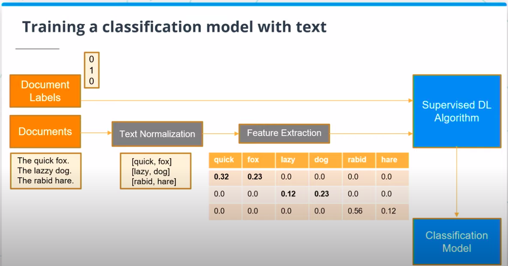

***

## Two Perspectives on ML: Computer science vs. Statistical perspective

- Computer Science: Use input features to create a program that can generate the desired output.

  ```text
  Output = Program(Input Features)
  ```

- Statistical Perspective: Find a mathematical function that, given the values of the independent variables can predict the values of the dependent variables.

  ```text
  Output Variable = f(Input Variables)
  ```

***

## Machine Learning EcoSystem

A typical machine learning ecosystem is made up of three main components:

- **Libraries**: A library is a collection of pre-written (and compiled) code that you can make use of in your own project.

  | Libraries | Examples |
  | --------- | -------- |
  | Core Framework and Tools | Python, Pandas, Numpy, jupyter |
  | Machine Learning and Deep Learning | Scikit-learn, Apache Spark, Tensorflow, Keras, PyTorch |
  | Data Visualization | Plotly, Matplotlib, Seaborn, Bokeh |

- **Development environments**: A development environment is a software application (or sometimes a group of applications) that provide a whole suite of tools designed to help you (as the developer or machine learning engineer) build out your projects. `Jupyter Notebooks` and `Visual Studio` are examples of development environments.

- **Cloud services**: A cloud service is a service that offers data storage or computing power over the Internet. In the context of machine learning, you can use a cloud service to access a server that is likely far more powerful than your own machine, or that comes equipped with machine learning models that are ready for you to use.

  - Core Asset management

  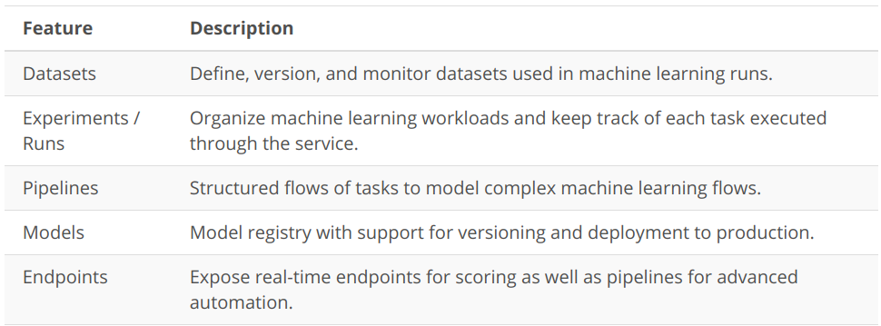

  - Resource Mangement

  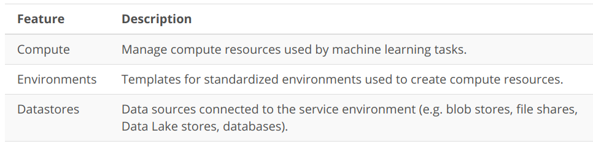

***

## Models vs Algorithms

> Models are the specific representations learned from data whereas algorithms are the processes of learning.

```text
Model = Algorithm(Data)
```

We can think of an algorithm as a mathematical tool that can usually be represented by an equation as well as implemented in code. For example, `y = Wx + b` is an algorithm that can be used to calculate `y` from `x` if the values for `W` and `b` are known. But how do we get `W` and `b`?

This is the learning part of machine learning; That is, we can learn these values from training data.

***

Machine learning algorithms aim to learn a target function (f) that describes the mapping between data input variables (X) and an output variable (Y).

`Y=f(X)`

Since the process extrapolates from a limited set of values, there will always be an error ee which is independent of the input data (XX) such that:

`Y=f(X)+e`

The variable ee is called irreducible error because no matter how good we get at estimating the target function (f), we cannot reduce this error.

***

## Linear Regression

- linear regression is an algorithm that uses a straight line (or plane) to describe relationships between variables.

- Linear regression is all about finding the line that best fits the data.

### Simple Linear Regression

You may recall from fundamental algebra that the general equation for a line looks like this:

```math
y = m x + b
```

Where `m` is called the slope of the line, and `b` is the y-intercept. Again, this is the general equation. For a specific line, we need to know the values for the slope and y-intercept.

### Linear Regression in Machine Learning

In machine learning, you will also often see the equation represented using different variables, as in:

```math
y=B0 + B1 ∗x
```

The letters are different and the order has been changed, but it is exactly the same equation. Thus, we can see that what we know from algebra as the basic equation for a line is also, in machine learning, the equation used for `simple linear regression`.

### Multiple Linear Regression

In more complex cases where there is more than one input variable, we might see something like this:

```math
y = B0 + B1∗x1 + B2∗x2 + B3∗x3... + Bn ∗xn
```

In this case, we are using multiple input variables to predict the output. When we have multiple input variables like this, we call it `multiple linear regression`.

### Training a Linear Regression Model

> To "train a linear regression model" simply means to learn the coefficients and bias that best fit the data. This is the purpose of the linear regression algorithm.

#### The Cost Function

When we make a prediction using the line, we expect the prediction to have some error.

> `The process of finding the best model is essentially a process of finding the coefficients and bias that minimize this error. To calculate this error, we use a cost function`.

There are many cost functions you can choose from to train a model and the resulting error will be different depending one which cost function you choose. The most commonly used cost function for linear regression is the root mean squared error (RMSE).

#### Preparing the Data

There are several [assumptions](https://www.jmp.com/en_us/statistics-knowledge-portal/what-is-regression/simple-linear-regression-assumptions.html) or conditions you need to keep in mind when you use the linear regression algorithm:

- Linear assumption.

- Remove collinearity.

- Gaussian (normal) distribution.

- Rescale data.

- Remove noise.

#### Calculating the Coefficients

The formula for getting the slope of the line looks something like this:

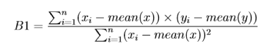

To get the intercept, we calculate:

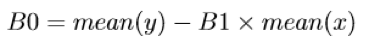

And to get the root mean squared error (RMSE), we have:

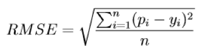
